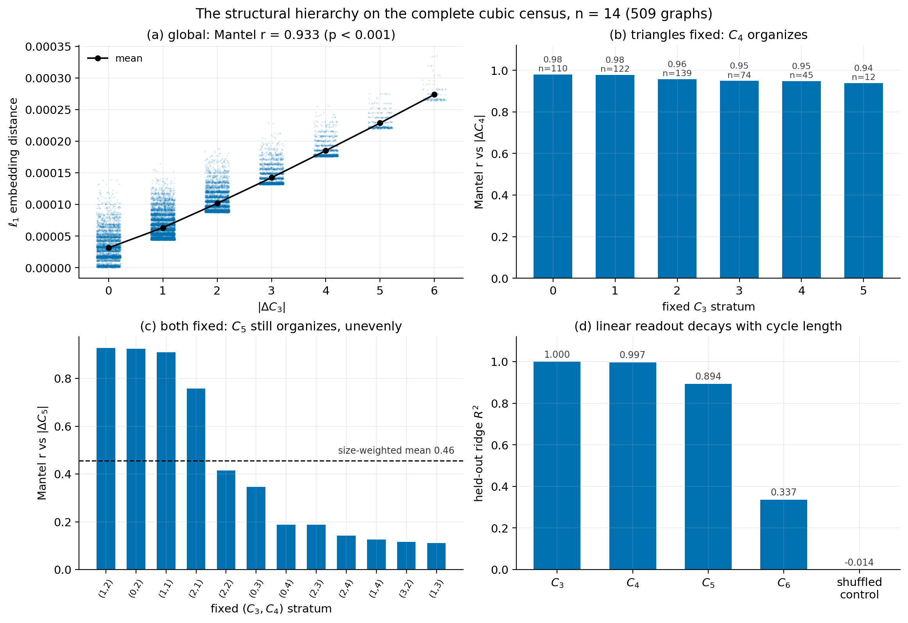
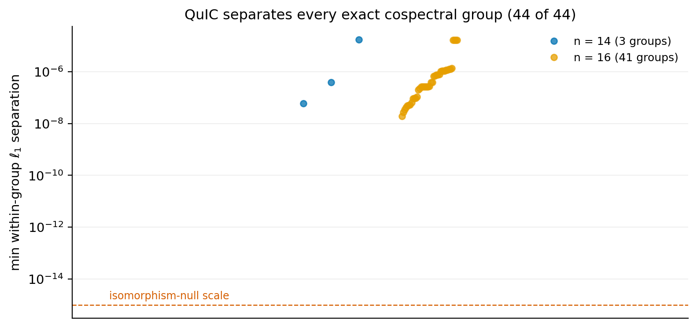
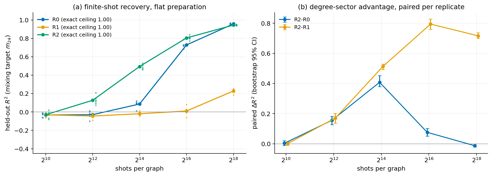

# QuIC Structural Characterization

**Which graph structure is encoded — and which of it is actually
recoverable — in a shallow, training-free quantum graph feature map.**

QuIC (Miller & Lee, IEEE QCE 2026;
[arXiv:2604.18841](https://arxiv.org/abs/2604.18841)) maps a graph to the
sorted output distribution of a fixed-parameter, phase-encoded circuit:

```
G  →  phase-encoded circuit U_G  →  p_G  →  invariant readout  →  recoverable graph structure
```

This repository is the structural characterization of that map: exact
theory, exhaustive-census experiments, and finite-shot measurement studies,
organized as a small tested package plus five self-contained notebooks. The
claims, in one paragraph: **a depth-one phase-encoded circuit encodes
short-cycle structure in a definite order ($C_3 \to C_4 \to C_5$); the
encoding is provably not a function of the adjacency spectrum (exact
cospectral witnesses separate, and their differences rank non-spectral
invariants); and the choice of measurement readout — not the shot budget —
is what decides whether any of it survives sampling.**



## Three findings

**1 · Structural hierarchy** — On the *complete* population of 509 connected
cubic graphs at $n=14$: embedding geometry is triangle-dominated (Mantel
$r = 0.93$); with triangles fixed, four-cycles organize every stratum
($r = 0.94$–$0.98$); with both fixed, five-cycles still organize most
strata. Linear readout decays in the same order:
$R^2 = 1.000,\ 0.997,\ 0.894,\ 0.337$ for $C_3, C_4, C_5, C_6$. The order
is predicted by an exact second-order theorem, not fit post hoc.

**2 · Non-spectral content** — All 44 exactly-cospectral groups across the
$n = 14$ and $n = 16$ cubic censuses (cospectrality certified over the
integers) receive distinct embeddings, $10^{7}$–$10^{10}$ times the
numerical null, robustly across the entangler angle. Within those groups,
truncated-embedding differences rank the automorphism count 14/14
($p = 10^{-4}$) and the Wiener index 18/26 ($p = 0.038$) while the spectrum
— chance by construction — ranks nothing.

**3 · The readout decides** — On irregular graphs, three
permutation-invariant readouts with near-identical *exact* ceilings behave
completely differently under sampling: degree-sector pooling (64 dims)
recovers the degree-mixing target at $2^{14}$ shots; the global sort needs
$\sim 2^{16}$; Hamming-weight pooling (15 dims, the *easiest to estimate*)
never reaches half its ceiling at any tested budget. Exact accessibility
does not imply statistical accessibility, and measurement design — not
budget — is the binding constraint.

## Quick start

```bash
pip install -e ".[notebooks]"        # numpy, networkx, scipy, sklearn, qiskit
apt install nauty                    # census enumeration (brew install nauty on macOS)

python -c "import quic; quic.selfcheck()"   # the mathematical audit
python examples/compare_graphs.py           # prism vs K33 in 5 seconds
```

`quic.selfcheck()` verifies the package against an independent
implementation (Qiskit vs pure NumPy, ~1e-15 agreement on every circuit
arm), plus relabeling invariance, dual readout implementations, and the
exact counting identities. Every notebook runs it first.

## The five notebooks

| | notebook | question | runtime |
|---|---|---|---|
| 01 | [The QuIC feature map](notebooks/01_quic_feature_map.ipynb) | What is the representation? | seconds |
| 02 | [Boundary & motif formalism](notebooks/02_boundary_and_motif_formalism.ipynb) | What does the circuit *provably* encode? | ~1 min |
| 03 | [Structural hierarchy](notebooks/03_structural_hierarchy.ipynb) | What organizes a complete census? | ~1 min |
| 04 | [Cospectral witness](notebooks/04_cospectral_witness.ipynb) | Is it spectral? (No — exactly.) | ~1 min |
| 05 | [Readouts & finite shots](notebooks/05_readouts_and_finite_shots.ipynb) | What survives measurement? | ~1 min |

## Core mathematical results

Derived and numerically certified in notebook 02 (narrative in
[docs/THEORY.md](docs/THEORY.md)):

* **Cut-phase identity.** The entangler acts as
  $e^{i\gamma\, c_G(x)}$ — the graph enters as a phase potential in the cut
  function; equivalently an imaginary-temperature Ising model.
* **Boundary transform.** Pre-mixer Walsh coefficients are subgraph
  generating functions: closed sectors count cycle packings
  ($[z^k] = C_k$ for $k \le 5$ on cubic graphs); open-sector valuations are
  graph distances.
* **Weak-mixer response.** $p'_G(x;0)$ is an exact, local,
  cosine-filtered discrete gradient of the cut function.
* **Motif closure.** On cubic graphs,
  $M_2''(0) = A_n + b_3 C_3 + b_4 C_4 + b_D D_\diamond$ — exact, with
  computed coefficients and an exhaustively verified cancellation that
  closes the basis.
* **Head certificate.** At the canonical angles, analytic bounds prove the
  first $1 + n + \binom{n}{2}$ sorted coordinates are exactly the
  $\le 2$-defect outcomes for every cubic graph at $n = 14, 16$ — and this
  layer *is* the pair census.

Each theorem ships with its scope: what is *not* claimed is listed at the
end of notebook 02 and enforced throughout.

## Selected results





Question-by-question summaries with limitations and the collected negative
results: [docs/EXPERIMENTS.md](docs/EXPERIMENTS.md).

## Repository structure

```
src/quic/            the package: circuits, exact simulator, readouts,
                     graph features, finite-shot tools, datasets, theory
notebooks/           the five-notebook series (all executed, all seeded)
examples/            three runnable entry points
data/demo_graphs/    small committed populations (graph6 + JSON, ~70 KB)
data/curated_results/  summary CSVs, regenerated by scripts/
scripts/             deterministic regeneration of everything in data/
docs/                THEORY.md · EXPERIMENTS.md · REPRODUCIBILITY.md
figures/             README figures, saved by the notebooks
```

## Reproducibility

Everything regenerates from an empty environment: censuses are enumerated
by `nauty-geng` with asserted counts (OEIS A002851) and SHA-256
fingerprints, all sampling is seeded, and the committed data files are the
output of one script. Details, fingerprints, and numerical caveats:
[docs/REPRODUCIBILITY.md](docs/REPRODUCIBILITY.md).

## Publications

The QuIC embedding and its hardware evaluation (up to 66 qubits on IBM
Heron) are introduced in:

> Luke Miller and Yugyung Lee. *QuIC: A Training-Free Quantum Graph
> Embedding from Ideal Analysis to Practical Hardware Evaluation.* IEEE
> International Conference on Quantum Computing and Engineering (QCE), 2026.
> [arXiv:2604.18841](https://arxiv.org/abs/2604.18841)

This repository contains the structural and statistical characterization of
the representation; citation information in [CITATION.cff](CITATION.cff).
